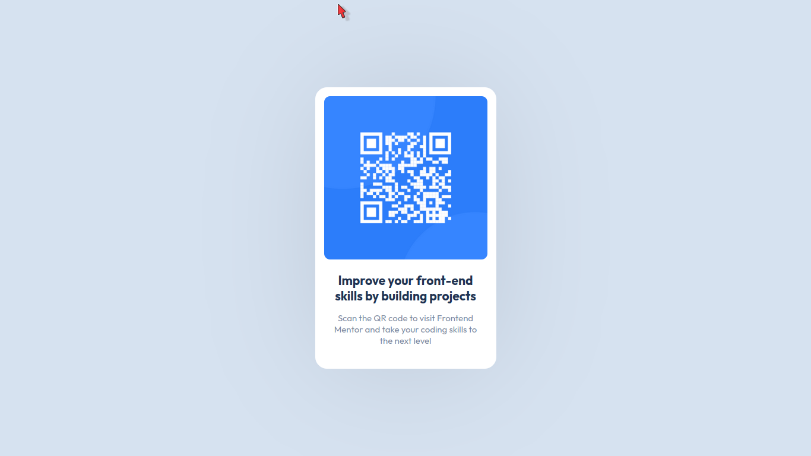
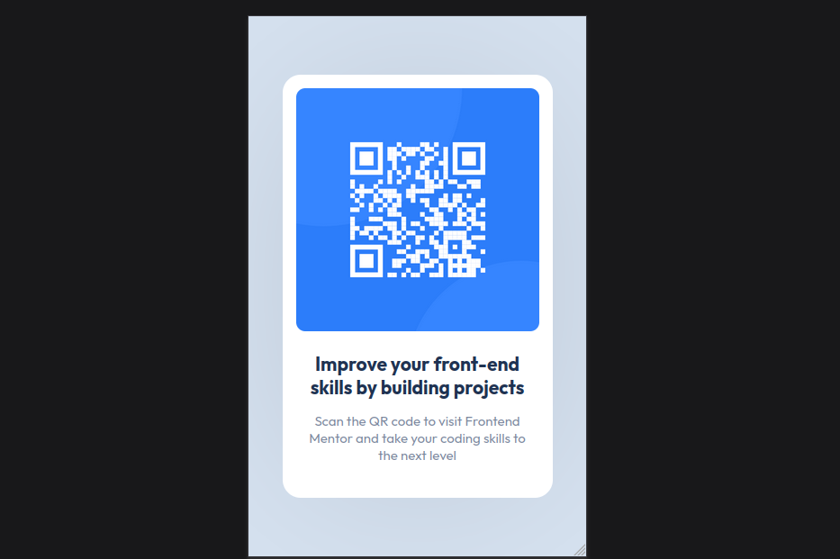

# Frontend Mentor - QR code component solution

This is my FIRST PROJECT using HTML & CSS and this is a solution to the [QR code component challenge on Frontend Mentor](https://www.frontendmentor.io/challenges/qr-code-component-iux_sIO_H).

## Table of contents

- [Overview](#overview)
  - [Screenshot](#screenshot)
  - [Links](#links)
- [My process](#my-process)
  - [Built with](#built-with)
  - [What I learned](#what-i-learned)
  - [Continued development](#continued-development)
- [Author](#author)

## Overview

### Screenshot

#### Desktop View

#### Mobile View

### Links

1. [Solution URL](https://www.frontendmentor.io/solutions/qr-code-component-1aj2IRqxx9)
2. [Live Site URL](https://sakthiprabhu-k.github.io/qr-code-project/)

## My process

### Built with

- Semantic HTML5 markup
- Cascading Style Sheets (CSS)
- Flexbox

### What I learned

- Figured out how to approach design.
- Learned how to make websites look good on different screens.
- Started writing code that's easier to understand and fix.

### Continued development

I'm still getting the hang of:

- Designing for mobile devices first, making websites look good on phones.
- Using media queries to adjust my designs for different screens.
- Ensuring my websites work well on different web browsers.

## Author

- LinkedIn - [@sakthiprabhu-k](https://www.linkedin.com/in/sakthiprabhu-k)
- Frontend Mentor - [@sakthiprabhu-k](https://www.frontendmentor.io/profile/sakthiprabhu-k)
